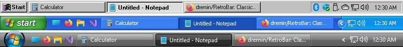

UltraWinBar is a fork of [RetroBar](https://github.com/dremin/RetroBar), the upstream project.

# UltraWinBar

[Changelog](UltraWinBar/Support/docs/CHANGELOG.md)

[Source tree and build instructions](UltraWinBar/Support/docs/STRUCTURE.md)

   

Pining for simpler times? UltraWinBar teleports you back in time by replacing your modern Windows taskbar with the classic Windows 95, 98, Me, 2000, XP, or Vista style.

UltraWinBar is based on the [ManagedShell](https://github.com/cairoshell/ManagedShell) library for great compatibility and performance.

## Requirements
- Windows 7 SP1, Windows 8.1, Windows 10, or Windows 11
  - Fresh installs of Windows 7 may require additional Windows updates.
- Microsoft .NET Desktop Runtime - When using the UltraWinBar installer, this is automatically downloaded and installed if necessary. If you're using the portable version, you will be prompted to download on first launch.

## Features
- Replaces default Windows taskbar with classic layout
- Native notification area with balloon notification support
- Native task list with UWP app support and drag reordering
- Quick launch toolbar
- Start button opens modern start menu
- Ability to show or hide the clock
- Ability to auto-hide the taskbar
- Locked and unlocked taskbar appearances
- Display taskbar on any side of the screen (even on Windows 11)
- Resizable taskbar with support for multiple rows
- Option to display the taskbar, notification area, and clock on multiple monitors
- Ability to show Vista-style window thumbnails
- Customizable XP-style collapsible notification area with drag reordering
- Input language and keyboard layout switcher
- Custom theme support

## Included themes
- System (Classic, XP, and Vista)
- Watercolor
- Windows 95-98
- Windows Me
- Windows 2000
- Windows XP:
  - Classic
  - Blue
  - Olive Green
  - Silver
  - Royale
  - Royale Noir
  - Embedded Style
  - Zune Style
- Windows Longhorn Aero
- Windows Vista:
  - Aero
  - Basic
  - Classic

Additional themes can be installed through Properties > Advanced.

## Supported languages
- Arabic (العربية)
- Basque (euskara)
- Belarusian (беларуская)
- Bulgarian (български)
- Catalan (català)
- Chinese (Simplified) (中文(简体))
- Chinese (Traditional) (中文(繁體))
- Croatian (hrvatski)
- Czech (čeština)
- Danish (dansk)
- Dutch (Nederlands)
- English
- English (United Kingdom)
- Finnish (Suomi)
- French (français)
- German (Deutsch)
- Greek (ελληνικά)
- Hebrew (עברית)
- Hungarian (magyar)
- Icelandic (íslenska)
- Indonesian (Indonesia)
- Italian (italiano)
- Japanese (日本語)
- Korean (한국어)
- Latvian (latviešu)
- Lithuanian (lietuvių)
- Luxembourgish (Lëtzebuergesch)
- Macedonian (Македонски)
- Malay (Melayu)
- Maltese (Malti)
- Norsk (bokmål)
- Persian (فارسی)
- Polish (polski)
- Portuguese (português)
- Romanian (română)
- Russian (русский)
- Serbian (Cyrillic) (српски)
- Serbian (Latin) (srpski)
- Slovak (slovenčina)
- Spanish (español)
- Swedish (svenska)
- Thai (ไทย)
- Turkish (Türkçe)
- Ukrainian (українська)
- Vietnamese (Tiếng Việt)
- Welsh (Cymraeg)

## Custom languages and themes
UltraWinBar supports custom languages and themes. You may install community-made theme files that you have downloaded in UltraWinBar Properties > Advanced.

You may manually install custom languages or themes by creating a `Languages` or a `Themes` directory in `%localappdata%\UltraWinBar`, and placing valid `.xaml` language or theme files there.

Themes use the XAML `ResourceDictionary` format. When creating a new theme, [view the included example themes](https://github.com/PHPCraftdream/UltraWinBar/tree/master/UltraWinBar/Assets/Themes) to get started.

## Per-panel pinned applications and virtual desktops

Right-click a task and choose **Pin to this taskbar**. A closed pinned application
keeps one icon; a running application shows a separate task button and title for
each open window. Clicking a task activates that specific window.
Launching a pinned icon assigns the application to that panel on the current
Windows virtual desktop.

Panel assignments, pinned applications, and task order are saved by virtual
desktop ID. Restarting UltraWinBar preserves these settings for already-running
windows. This does not relaunch applications or recreate windows after Windows
reboots. Existing assignments without a desktop ID remain fallback rules;
new assignments override them only on their own desktop. Existing pins are
initially associated with the desktop active when this feature is first loaded.

The desktop assignment checks run without creating any windows:
`dotnet run --project UltraWinBar/Support/tests/DesktopRules/DesktopRules.csproj`
(build `UltraWinBar/Support/BuildTools/UltraWinBar.sln` for `net6.0-windows` first).

## Open-Shell Menu users

You may need to adjust some Open-Shell Menu settings for the best compatibility with UltraWinBar. We recommend the following settings:

- Controls > Windows Key opens > Open-Shell Menu
- Menu Look > Align start menu to working area
